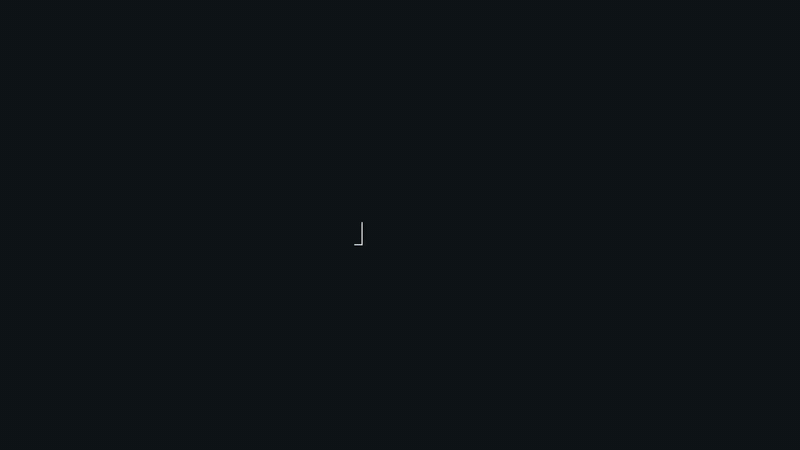
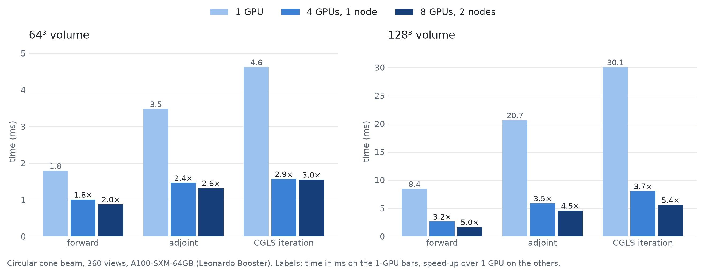
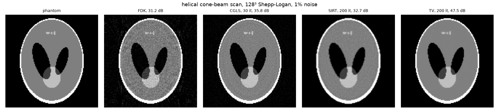
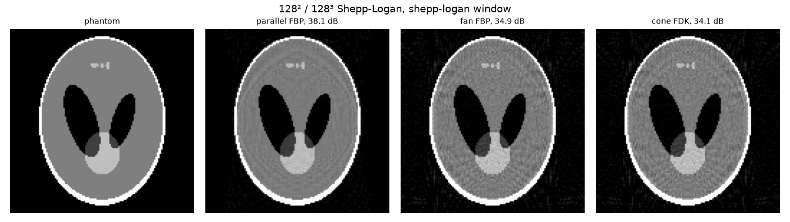

<h1 align="center">diffct</h1>

<p align="center">English · <a href="README.zh.md">简体中文</a></p>

<p align="center">
  Differentiable CUDA projectors for CT: arbitrary trajectories, multi-GPU, multi-node, geometry gradients.
</p>

<p align="center">
  <a href="https://opensource.org/licenses/Apache-2.0"></a>
  <a href="https://doi.org/10.5281/zenodo.14999333"></a>
  <a href="https://pypi.org/project/diffct/"></a>
  <a href="docs/source/trajectories.rst"></a>
  <a href="https://github.com/sypsyp97/diffct/actions"></a>
  <a href="https://deepwiki.com/sypsyp97/diffct"></a>
</p>

<p align="center">
  
</p>

<p align="center">
  <a href="docs/assets/diffct_intro.mp4">Intro video (MP4)</a> ·
  <a href="https://www.preprints.org/manuscript/202605.1446/v1">Technical report</a> ·
  <a href="https://doi.org/10.20944/preprints202605.1446.v1">DOI</a>
</p>

<p align="center">
  <a href="#install">Install</a> ·
  <a href="#quickstart">Quickstart</a> ·
  <a href="#why-diffct">Features</a> ·
  <a href="#performance">Performance</a> ·
  <a href="#examples">Examples</a> ·
  <a href="#citation">Citation</a>
</p>

> **Branch status.** This README describes the candidate branch
> `codex/arbitrary-trajectory-multigpu`. The GitHub default branch and the PyPI
> release do not contain the `Projector` API yet. Start with the
> [branch guide](docs/source/trajectories.rst) and read the
> [migration notes](docs/MIGRATION.md) before you move from the circular-only API.
>
> The Apple/MLX port is maintained by
> [Linda-Sophie Schneider](https://github.com/Linda-SophieSchneider) at
> [DiffCT-MLX](https://github.com/Linda-SophieSchneider/DiffCT-MLX).

## Why diffct

- **Arbitrary trajectories.** Each view has its own source, detector centre and
  detector axes. Circular, helical, saddle, sinusoidal, random and calibrated
  scans use the same code.
- **Matched operators.** `project()` and `backproject()` form an exact adjoint
  pair for the cell-constant Siddon model. Both support PyTorch autograd,
  with volume/sinogram gradients and second derivatives (Hessian-vector products).
- **Geometry gradients.** Trajectory tensors with `requires_grad=True` receive
  gradients for calibration and trajectory optimization.
- **Multi-GPU and multi-node.** Use `devices=[0, 1, 2, 3]` in one process, or
  one process per GPU with torchrun and NCCL. Views are partitioned; the
  volume is replicated. Speedup depends on workload and communication costs.
- **Analytical helpers.** `diffct.analytical` provides ramp filters (ram-lak,
  shepp-logan, cosine, hamming, hann), fan, cone and Parker weights, and FBP
  and FDK backprojection.
- **Validated.** FDK matches ASTRA 2.5.0 `FDK_CUDA` on the same projections:
  PSNR within 0.3 dB, and a maximum pixel difference below 1% of the phantom
  maximum. Geometry gradients match an independent float64 reference to about
  1e-6. The [recorded A100 validation](docs/VALIDATION.md) reports 229 passing
  pytest tests; these are measured results, not guarantees for every scan.

### Capabilities and limits

| Area | Supported here | Important limit |
|---|---|---|
| Acquisition | 2D parallel/fan and 3D cone beams; per-view source/detector geometry | Flat detectors with unit direction axes; no arbitrary-trajectory `sf`, `sf_tr` or `sf_tt` backend |
| Autograd | Volume/sinogram gradients and second derivatives; first-order geometry gradients | Geometry second derivatives raise an error; validity checks run at construction |
| Execution | CUDA, one-process multi-GPU, or distributed ranks across nodes | Kernels and outputs are float32; CPU geometry is allowed, CPU projection is not |
| Reconstruction | Matched adjoint plus separate FBP/FDK helpers | `backproject()` is not an inverse; FDK remains approximate and does not become exact for arbitrary scans |
| Memory | Views split across GPUs/ranks | Every participating GPU needs a full volume; local multi-GPU also gathers the full sinogram on the input device |

## Install

You need a CUDA GPU and PyTorch. Install PyTorch for your CUDA version first.

```bash
git clone https://github.com/sypsyp97/diffct.git
cd diffct && git checkout codex/arbitrary-trajectory-multigpu
pip install "numpy<2.5" "numba-cuda[cu12]"   # [cu13] for CUDA 13; install PyTorch for your CUDA first
pip install -e .
python examples/quickstart.py               # smoke test: prints adjoint mismatch ~1e-8 for each beam
```

<details>
<summary>Notes on CUDA versions</summary>

- Numba CUDA imports `numpy.row_stack`, which NumPy 2.5 removes. Keep
  `numpy<2.5`.
- Keep NVVM and NVJitLink compatible with the CUDA libraries that PyTorch
  loads. A newer NVVM with an older NVJitLink fails when the kernels compile.
- A tested CUDA 13 set:
  `pip install "numpy<2.5" "numba-cuda[cu13]" "cuda-toolkit[cccl,cudart,nvrtc,nvvm]==13.0.2" "nvidia-nvjitlink<13.1"`.
- A tested CUDA 12 set: PyTorch 2.10 (cu126) with `numba-cuda[cu12]` 0.30.4 on
  NVIDIA driver 535.

</details>

## Quickstart

Create the acquisition once. Then call `project()` and `backproject()`.

```python
import torch
from diffct import Projector, spiral_trajectory_3d

trajectory = spiral_trajectory_3d(360, sid=320.0, sdd=512.0, z_range=40.0, n_turns=1.0, device="cpu")
A = Projector(trajectory, volume_shape=(128, 128, 128), detector_shape=(384, 256), detector_spacing=0.8)

volume = torch.rand(A.volume_shape, device="cuda")
sinogram = A.project(volume)        # (360, 384, 256) line integrals
adjoint = A.backproject(sinogram)   # matched adjoint A^T

x = torch.zeros_like(volume, requires_grad=True)
loss = 0.5 * (A.project(x) - sinogram).square().sum()
loss.backward()                     # x.grad = A^T (A x - y)
```

### Custom or calibrated trajectories

Use a generator for a standard scan, or pass your calibrated tensors directly.
The tuple describes every source position, detector centre and detector axis;
no circular-orbit fit is required. For example, two illustrative cone views:

```python
calibrated = tuple(torch.tensor(rows, dtype=torch.float32) for rows in (
    [[-320.0, 0.0, -20.0], [0.0, -300.0, 25.0]],  # source (x, y, z)
    [[192.0, 0.0, -20.0], [0.0, 212.0, 25.0]],    # detector centre (x, y, z)
    [[0.0, 1.0, 0.0], [1.0, 0.0, 0.0]],         # unit detector u axes
    [[0.0, 0.0, 1.0], [0.0, 0.0, 1.0]],         # unit detector v axes
))
A_custom = Projector(calibrated, (64, 96, 128), (192, 128),
                     beam="cone", voxel_spacing=1.0, detector_spacing=(0.8, 1.0))
y_custom = A_custom.project(torch.ones(A_custom.volume_shape, device="cuda"))
# y_custom.shape == (2, 192, 128): (views, detector_u, detector_v)
```

Replace the two rows in each component with all views from your calibration,
in measurement order. Coordinates are world `(x, y, z)`; volume tensors are
`(z, y, x)` / `(D, H, W)`. Use one length unit for positions and spacings;
axes are unit directions, not pixel-sized vectors. See
[Geometry and units](#geometry-and-units) for 2D tuples and centring conventions.
The `custom_trajectory_3d` helper instead derives a detector pose from a source
path looking toward the origin; use explicit tuples when detector poses are
independently calibrated.

### Several GPUs and nodes

Choose the execution mode by how you want to hold the projections:

| Mode | Configuration | Projection ownership |
|---|---|---|
| One GPU | Default `Projector(...)` | Full sinogram on the input CUDA device |
| One process, several GPUs | `devices=[0, 1, ...]` | Views computed on several GPUs, then full sinogram gathered on the input CUDA device |
| One GPU per process, one or more nodes | `distributed=True` after process-group initialization | Rank-local sinogram with shape `A.projection_shape`, indexed by `A.view_slice` |

All modes require the full volume on each participating GPU. Local multi-GPU
execution also needs room for the full input/output sinogram on the caller's
device, plus temporary copies; it does not pool memory. Distributed mode keeps
projections sharded, while backprojection sums and replicates the full volume.

**One process, several GPUs:**

```python
A = Projector(trajectory, (128, 128, 128), (384, 256), detector_spacing=0.8, devices=[0, 1, 2, 3])
```

**One process per GPU, one or more nodes:**

```bash
torchrun --nproc-per-node=4 examples/iterative_reconstruction.py --trajectory helical      # one node
sbatch examples/slurm/multi_node.sbatch examples/iterative_reconstruction.py --trajectory helical   # several nodes
```

With `distributed=True`, every rank must make the same `project`, `backproject`
and backward calls, even on ranks with zero views. Use each rank's local
projection loss with SUM semantics; the operator sums image and geometry
gradients across ranks. Divide a loss on replicated backprojection output by
`world_size`. Do not add a DDP gradient reduction on top of the operator.
Initialization, loss examples, Slurm details and the cross-node
check are in [docs/DISTRIBUTED.md](docs/DISTRIBUTED.md).

### Geometry gradients

Trajectory tensors with `requires_grad=True` get gradients for the source,
detector centre and detector axes. The gradient is the exact derivative of the
cell-constant model. Set `requires_grad=True` before constructing `Projector`;
otherwise it snapshots the geometry. Rebuild it after changing fixed geometry.

```python
source, det_center, det_u, det_v = (t.clone() for t in trajectory)
source.requires_grad_()
A = Projector((source, det_center, det_u, det_v), (128, 128, 128), (384, 256), detector_spacing=0.8)
(A.project(volume) - sinogram).square().sum().backward()   # source.grad has shape (360, 3)
```

Second derivatives with respect to the geometry raise an error. Edge cases are
listed in [Geometry and units](#geometry-and-units).

## Performance

Time per iteration on Leonardo Booster (NVIDIA A100 64 GB, PyTorch 2.10 cu126,
numba-cuda 0.30.4). Scaling from one GPU to one node (4 GPUs) and two nodes
(8 GPUs):

<p align="center">
  <picture>
    <source media="(prefers-color-scheme: dark)" srcset="docs/assets/scaling_dark.png">
    
  </picture>
</p>

| 128³ volume | 1 GPU | 4 GPUs, 1 node | 8 GPUs, 2 nodes |
|---|---:|---:|---:|
| Forward projection | 8.46 ms | 2.67 ms (3.2×) | 1.69 ms (5.0×) |
| Adjoint (backprojection) | 20.69 ms | 5.91 ms (3.5×) | 4.53 ms (4.6×) |
| CGLS iteration | 30.07 ms | 8.09 ms (3.7×) | 5.54 ms (5.4×) |

Circular trajectory, 360 views, detector (2n, 1.5n) cells, pitch 1.25.
Small problems scale less. At 64³, one CGLS iteration takes 4.75 ms on 1 GPU,
1.57 ms on 4 GPUs (3.0×) and 1.56 ms on 8 GPUs (3.0×). Transfers and kernel
launches dominate at this size.

Reproduce on one process with several GPUs:

```bash
python examples/benchmark_projector.py --devices 0 1
```

For torchrun launch modes, see [docs/DISTRIBUTED.md](docs/DISTRIBUTED.md).

## Gallery

**Helical scan with 1% noise.** Shepp-Logan phantom, 128³. PSNR: FDK 31.2 dB,
CGLS (30 iterations) 35.8 dB, SIRT (200 iterations) 32.7 dB, TV (200
iterations) 47.5 dB.

<p align="center">
  
</p>

```bash
python examples/iterative_reconstruction.py --trajectory helical --noise 0.01 --figure out.png
```

**Analytical reconstruction.** Shepp-Logan window. PSNR: parallel FBP 38.1 dB,
fan FBP 34.9 dB, cone FDK 34.1 dB.

<p align="center">
  
</p>

```bash
python examples/analytical_reconstruction.py --figure out.png
```

## Examples

| file | what | launch modes |
|---|---|---|
| `quickstart.py` | Projector basics for parallel, fan, cone: project, backproject, adjoint check, image and geometry gradients | 1 GPU |
| `analytical_reconstruction.py` | parallel FBP, fan FBP, cone FDK; `--window` | 1 GPU |
| `iterative_reconstruction.py` | any trajectory (`--trajectory circular/helical/saddle/sinusoidal`); CGLS, SIRT, TV-regularized nonnegative least squares with Adam (autograd); FDK baseline; `--noise` | 1 GPU, `--devices 0 1 2 3`, torchrun, Slurm multi-node |
| `geometry_calibration.py` | recover per-view angle errors and a detector shift from projections with geometry gradients | 1 GPU, `--devices`, torchrun, Slurm multi-node |
| `benchmark_projector.py` | correctness and speed of one vs several GPUs | 1 process with `--devices`, torchrun |
| `plot_trajectory.py` | plot a trajectory generator | CPU |
| `slurm/multi_node.sbatch` | template: one torchrun launcher per node; set account/partition | Slurm |

Launch modes, distributed-loss rules and all measured results are in [examples/README.md](examples/README.md). Shared helpers are in `examples/_common.py`. The example scan uses n³ unit
voxels, a source 2.5 n from the isocentre, a detector 4 n from the source
(magnification 1.6), (3n, 2n) detector cells, pitch 0.8 and 360 views.

Geometry calibration (64³, 360 views, per-view angle error 0.54° RMS, detector
shift (1.5, -1.0) voxels, Adam 300 steps) recovers the angle error to
0.0001-0.0025° RMS and the detector shift to below 0.001 voxel in every launch
mode.

## Geometry and units

| Beam | Trajectory tuple, one row per view | Volume | Sinogram |
|---|---|---|---|
| `parallel` | `(ray_dir, det_origin, det_u)`, each `(views, 2)` | `(H, W)` | `(views, U)` |
| `fan` | `(src_pos, det_center, det_u)`, each `(views, 2)` | `(H, W)` | `(views, U)` |
| `cone` | `(src_pos, det_center, det_u, det_v)`, each `(views, 3)` | `(D, H, W)` | `(views, U, V)` |

- Use the helpers in `diffct.geometry` (`circular_*`, `spiral_*`,
  `sinusoidal_*`, `saddle_*`, `random_*`, `custom_*`), or pass calibrated
  tensors.
- Geometry rows use world `(x, y)` or `(x, y, z)` coordinates. Volume axes
  run in `(y, x)` or `(z, y, x)` order. There are no batch/channel dimensions.
- Direction vectors have unit length. `ray_dir` is orthogonal to `det_u`, and
  `det_u` is orthogonal to `det_v`. Detector pitch is a separate argument:
  a scalar in 2D, a scalar or `(du, dv)` pair for cone beams.
  `detector_shape=(U, V)` and cone sinograms always follow `(views, U, V)`.
- The volume is centred on the origin. Voxel `i` of an axis with `N` voxels has
  its centre at `(i + 0.5 - N / 2) * voxel_spacing`. Voxel spacing is one
  isotropic value.
- The detector array is centred. Pixel `k` of `N_det` pixels lies at
  `(k - (N_det - 1) / 2) * pitch` from `det_center` along `det_u`
  (`det_origin` for parallel beams), the same convention as `main`. For cone
  beams, add the analogous offset along `det_v` using its own pitch.
- Projections are line integrals in the length unit of the geometry. `Projector`
  rejects views where the source equals the detector centre, or the detector is
  edge-on to the source.
- The kernels work in float32. In fan and cone beams, the source or the
  detector centre must be within 1e6 voxels of the volume centre in each view;
  both must be within 1e15 voxels. Geometry may be on CPU or CUDA, but volumes
  and sinograms passed to the operator must be floating-point CUDA tensors.
  Ray positions are accurate to about 6e-8 times that nearer distance.

**Gradient edge cases:**

- On an exact voxel edge or corner, the kernels return the derivative of one
  adjacent side. Central finite differences average both sides, so they can
  differ. This occurs in symmetric setups, for example a principal ray parallel
  to a volume axis, a source on a voxel face plane, and equal detector pitches.
  For finite-difference checks, rotate the trajectory slightly, for example with
  `start_angle=0.1`.
- Geometry checks run only at construction. Optimize angles and offsets, not raw
  axis vectors, so the geometry stays valid.

## Documentation

| Document | Contents |
|---|---|
| [Branch guide](docs/source/trajectories.rst) | Trajectory tuples, `Projector` usage and scope of this branch |
| [docs/DISTRIBUTED.md](docs/DISTRIBUTED.md) | Execution/memory choices, distributed loss rules, Slurm and cross-node checks |
| [docs/VALIDATION.md](docs/VALIDATION.md) | Test commands, validation details and the limits of each check |
| [docs/MIGRATION.md](docs/MIGRATION.md) | Moving from the circular-only API |
| [docs/video/README.md](docs/video/README.md) | How the intro video is rendered |
| [CHANGELOG.md](CHANGELOG.md) | Release history |

Run the test suite on a CUDA host with `python -m pytest tests/ -q`.

## Citation

If you use this library in your research, please cite the software and the technical report:

```bibtex
@software{diffct2025,
  author    = {Yipeng Sun},
  title     = {diffct: Differentiable Computed Tomography Reconstruction with CUDA},
  year      = 2025,
  publisher = {Zenodo},
  doi       = {10.5281/zenodo.14999333},
  url       = {https://doi.org/10.5281/zenodo.14999333}
}

@article{202605.1446,
  doi       = {10.20944/preprints202605.1446.v1},
  url       = {https://doi.org/10.20944/preprints202605.1446.v1},
  year      = 2026,
  month     = {May},
  publisher = {Preprints},
  author    = {Yipeng Sun and Linda-Sophie Schneider and Chengze ye and Andreas Maier},
  title     = {diffct: Differentiable CT Operators from Circular Orbits to Arbitrary Trajectories},
  journal   = {Preprints}
}
```

## License and acknowledgements

Apache 2.0, see [LICENSE](LICENSE). The project draws on
[PYRO-NN](https://github.com/csyben/PYRO-NN) and
[geometry_gradients_CT](https://github.com/mareikethies/geometry_gradients_CT).
Issues and pull requests are welcome.
