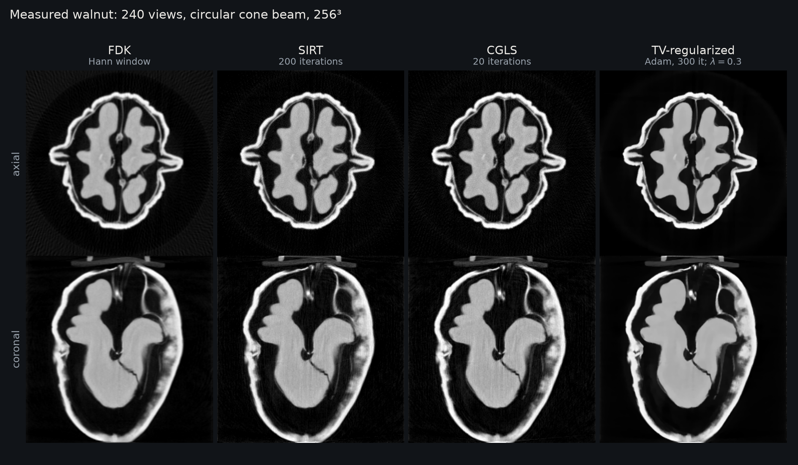
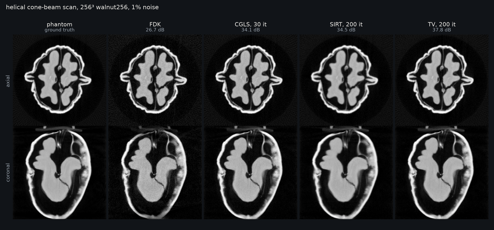

Measured Walnut
===============

``examples/walnut_reconstruction.py`` reconstructs a measured walnut from 240
cone-beam projections on a full circular orbit. The data are from Meaney 2022
(Zenodo 6986012, CC BY 4.0; see ``examples/data/NOTICE``). The scan geometry is
passed to ``Projector`` as explicit per-view tensors, the same way as a calibrated
trajectory.

Run it
------

.. code-block:: bash

   python examples/walnut_reconstruction.py --figure walnut.png
   python examples/walnut_reconstruction.py --size 512 --devices 0 1 2 3

The figure shows axial and coronal centre slices. The reconstructions are:

- FDK with a Hann window.
- SIRT (200 iterations).
- CGLS (20 iterations).
- TV-regularized least squares (300 Adam steps, weight 0.3).

Use ``--algorithms`` with no values to run FDK only. Use ``--window`` to change the
FDK filter.

Simulated helical scan
----------------------

``--save-volume`` stores the FDK volume scaled to [0, 1]. Use it as the phantom for
a simulated helical scan:

.. code-block:: bash

   python examples/walnut_reconstruction.py --algorithms --save-volume walnut256.npy
   python examples/iterative_reconstruction.py --size 256 --views 720 --trajectory helical \
       --noise 0.01 --phantom walnut256.npy --figure helical.png

